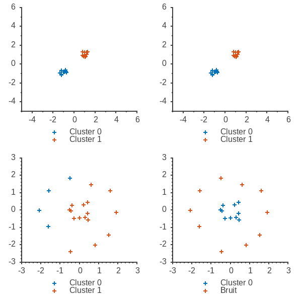

# Apprentissage non-supervisé : Clustering (Projet L3 S6)

## Introduction

## K-Moyennes
### Algorithme utilisé
```

```
### Analyse

### Implémentation

## DBSCAN
### Algorithme utilisé
```
```
### Analyse

### Implémentation


## Résutats et Discussion




## Conclusion et pistes d'amélioration

## Sources
###### KMeans
*https://en.wikipedia.org/wiki/K-means_clustering, consulté le 5 mars 2021*

###### DBSCAN
*https://en.wikipedia.org/wiki/DBSCAN,  consulté le 8 mars 2021*

*Ester, Kriegel, Sander, Xu. (1996). “A Density-Based Algorithm for Discovering Clusters
in Large Spatial Databaseswith Noise” in Proceedings of the 2nd International Conference on Knowledge Discovery and Data mining.*

*R. Xu and D. C. Wunsch, "Survey of Clustering Algorithms," IEEE Transactions on Neural Networks,
Institute of Electrical and Electronics Engineers (IEEE), May 2005.*

## Annexe : Compiler et exécuter le programme
### Compiler
:warning: Pour pouvoir afficher les clusters le programme dépend de GNUPLOT. Vous pouvez télécharger la dernière version de gnuplot grâce à votre gestionnaire de paquets. 
###### Ubuntu
```bash
    apt install gnuplot-qt
```
En mode `RELEASE` cmake Utilise la sortie graphique si GNUPLOT est disponible, en mode `DBG` , il faut affecter `TRUE` à la variable `USE_SCIPLOT`

```bash
    cmake -D USE_SCIPLOT=TRUE ..
    make
```

### Exécuter
Dans le dossier `.build/`, utiliser l'exécutable `./run` pour lancer le programme d'exemple ou `./test_clustering` pour effectuer les tests.

Le programme utilise une sortie graphique pour afficher les clusters ainsi que la sortie standard pour afficher le rapport d'exécution des algorithmes. Attention, ce rapport peut excéder la capacité d'affichage du terminal si le nombre de points est trop élévé.

Les tests utilisent la librairie Googletest, `./test_clustering` peut prendre en argument tous ceux définis par la librarie. 
En particulier `./test_clustering -h` permet de lister les argumements possibles et `./test_clustering --filter=<regex>` permet de n'exécuter qu'une partie des tests.  


